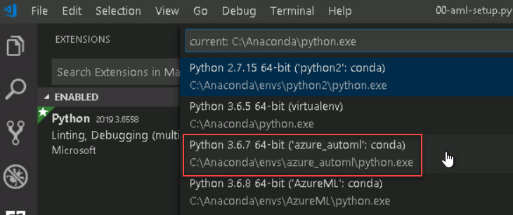

# Quickstart-1.0 
# Setting up your environment
1. **Login** to [Azure portal](https://portal.azure.com) using the credentials provided in the environment details page. Please open the portal in a **private browser window**, if you already have an Azure account.
2. Open the resource group that you have access to.
3. You can find a **Virtual Machine** in the resource group.
## Open the starting Python file

1. On your virtal machine, **open** the **Lab-Files** folder from the desktop and navigate to **azure-machine-learning-quickstarts-master>aml-python-sdk>starter-artifacts>00-aml-setup>visual-studio-code>00-aml-setup** folder.
2. **Open Visual Studio Code** by double clicking the starting python file: **`00-aml-setup.py`**.
3. Install Python extension in vs code and reload.  
<kbd></kbd>  
4. Setup **azure_automl** as your **interpreter** : In VS code, when you first open the starting python file for a quickstart,click on view button. Select **Command Palette** (⇧⌘P).  
<kbd></kbd>  
5. Select **Select Interpreter** command and select the **azure_automl** as your interpreter.   
<kbd></kbd>  
<kbd></kbd>  
6. After this, to execute each step, **click** on **Run Cell** just above the block of code.  
<kbd></kbd>  
7. Follow the instructions within the python file to complete the quickstart.
